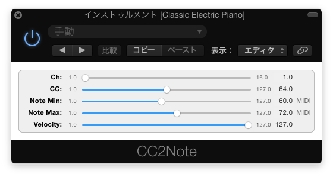

CC2Note
============

CC2Note MIDI FX

## Installation

Generally, Audio Units Plugins are available for only Mac OSX.

1. Click "Download ZIP" and extract CC2Note.component.
2. Move CC2Note.component to /Library/Audio/Plug-Ins/Components

## Available DAW

* Logic Pro X
* Mainstage 3

## License

CC2Note has an MIT Licence http://en.wikipedia.org/wiki/MIT_License
